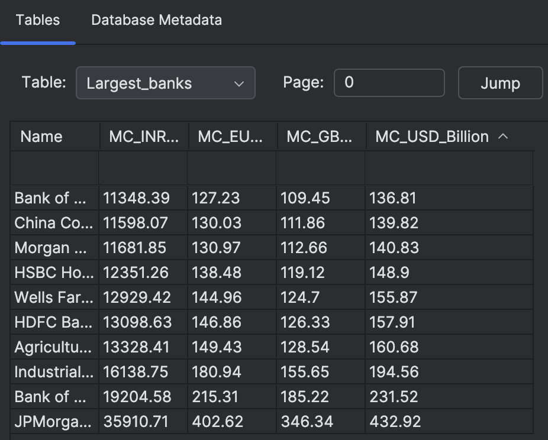
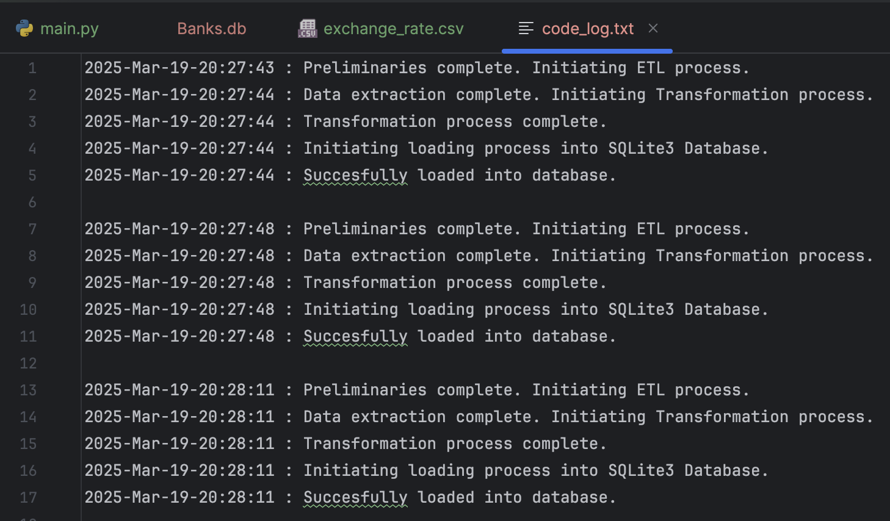
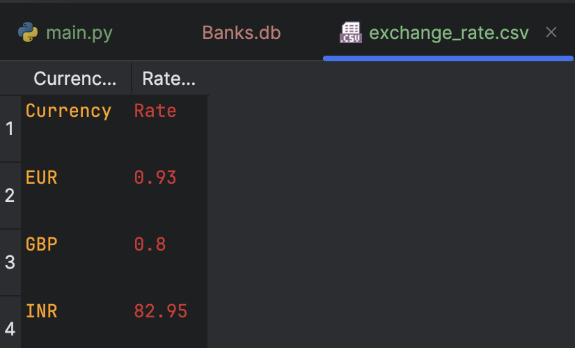

# Bank Data Web Scraper & Currency Converter

This Python application automates the process of extracting, transforming and storing financial data. It utilizes BeautifulSoup to scrape the table containing the top 10 largest banks from Wikipedia. 

- The transformation process involves currency conversion and the addition of three currency columns for EUR, GBP and INR, using exchange rates provided by the 'exchange_rate.csv' file.

- The loading process consists of loading the dataset into an SQLite3 database. The transformed dataset is also exported to a local .csv file for further analysis or reporting.

- For process tracking and error handling, the app logs every step of the process in code_log.txt, including any exceptions or issues that may arise, with detailed timestamps for efficient debugging and monitoring.

# Screenshots
 

